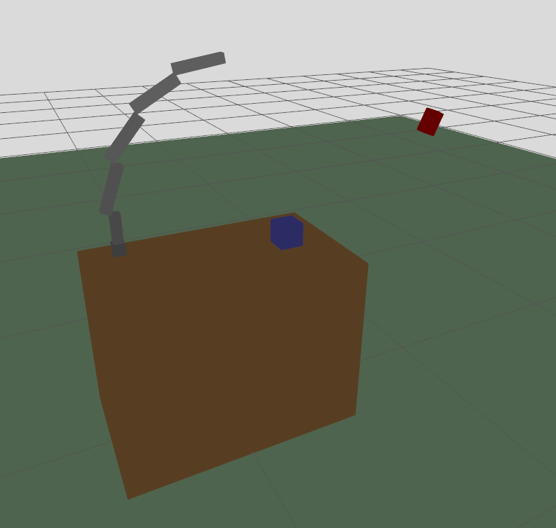

# Ejercicio 6 (world_exercise)

Este paquete responde al ejercicio de simulación de un entorno en ROS 2 con Gazebo/Ignition.



## Descripción

**Incluye:**
- Un brazo robótico de cinco eslabones, cada uno con un tono de gris diferente, montado sobre una mesa.
- Una mesa modelada en el mismo URDF que el robot.
- Un cubo azul ubicado sobre la mesa.
- Una cámara virtual roja, visible en el mundo y orientada hacia el centro de la cara superior de la mesa.
- Un plano base de color verde claro.

## Archivos principales

- `urdf/arm_robot.urdf`: Modelo del robot y la mesa.
- `worlds/exercise_world.world`: Mundo SDF con plano, cubo y cámara.
- `launch/world.launch.py`: Lanzador para simular el entorno completo.

## Uso

1. Compila el paquete y haz un `source` del `setup.bash`:
   
  ```bash
  colcon build --packages-select world_exercise
  source install/setup.bash
  ```

2. Lanza el entorno con:
   
  ```bash
  ros2 launch world_exercise world.launch.py
  ```

  El robot aparecerá sobre la mesa, el cubo azul y una cámara roja apuntando a la mesa.

## Notas

- El robot y la mesa están en el mismo modelo URDF.
- La cámara es un sensor virtual y también tiene visualización 3D.
- Puedes modificar posiciones y colores editando los archivos URDF/SDF.
